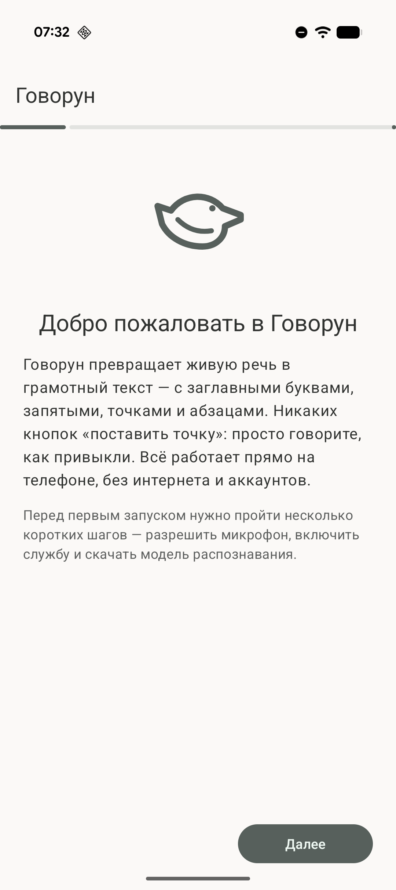
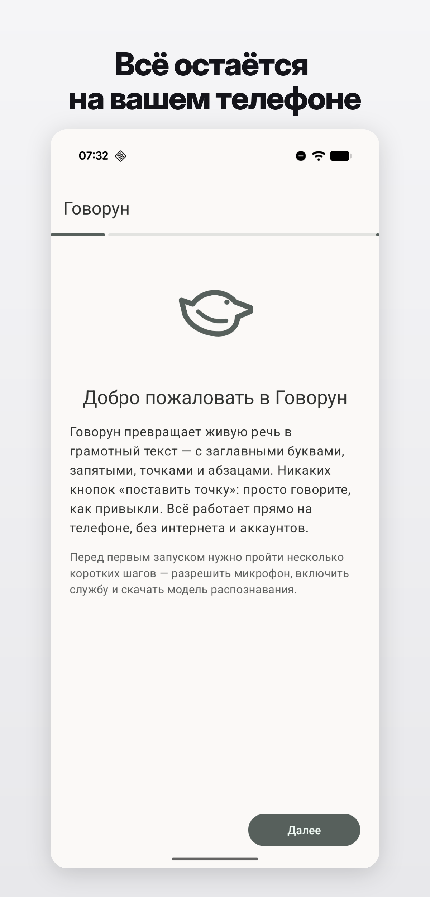
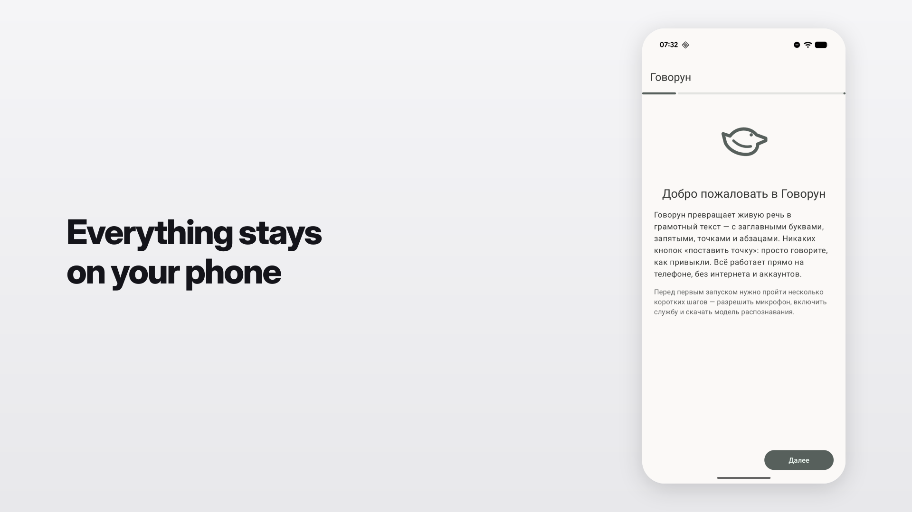

# shotframe

Wrap raw phone screenshots in a polished canvas for app-store listings.
One Python script, one command — no design tool required.

<p align="center">
  
  &nbsp;&nbsp;→&nbsp;&nbsp;
  
</p>

<p align="center">
  
</p>

## What it does

Takes a folder of phone screenshots, adds a neutral-grey backdrop, a bold
headline, soft drop shadow and rounded corners around the device screen,
and renders polished PNGs ready for RuStore, Google Play, or App Store
listings. Two layouts are built-in:

- **Portrait** (default) — caption on top, screenshot below; canvas derived
  from each input PNG so it scales to whatever resolution you feed in.
- **Landscape 16:9** (`layout_mode: landscape_16_9`) — 1920×1080 canvas with
  the phone on the right and the caption centered on the left. Ready to
  upload to stores that expect 16:9 feature graphics, RuStore in particular.

All text is rendered via SVG and `rsvg-convert`, so Cyrillic (and anything
else `fontconfig` can find) is first-class.

## Requirements

- Python 3.9+
- [PyYAML](https://pypi.org/project/PyYAML/)
- `rsvg-convert` (Debian/Ubuntu: `apt install librsvg2-bin`; macOS: `brew install librsvg`)
- A display sans font with the glyphs you need. The default template uses
  Inter Display — install on Debian/Ubuntu with `apt install fonts-inter`,
  or override `caption.font_family` in the config.

## Install

```bash
git clone https://github.com/amidexe/shotframe.git
cd shotframe
pip install -r requirements.txt   # just PyYAML
```

There is no package yet — call `shotframe.py` directly.

## Just point it at a folder

The simplest workflow: drop your raw screenshots in a folder and run

```bash
python shotframe.py path/to/folder
```

shotframe walks every PNG in the folder, prompts you for a caption
(up to two lines, max 28 characters per line), and writes polished
PNGs into `path/to/folder/processed/`. No config file required.

Run with no arguments to do the same in the current directory:

```bash
cd my-screenshots
python shotframe.py
```

Type `skip` at any prompt to drop a screenshot. An empty line ends
the caption (you can use one line or two).

## Quick start with the bundled example

```bash
cd examples
python ../shotframe.py shotframe.yaml
# polished PNGs appear in ./after/

# or render the 16:9 landscape variant:
python ../shotframe.py shotframe-landscape.yaml
# polished PNGs appear in ./after-16x9/
```

## Config-driven mode

For repeatable runs (or when you want the captions checked into git),
use a YAML config:

```bash
python shotframe.py --init        # writes shotframe.yaml in the current dir
# edit shotframe.yaml — set input_dir / output_dir / screenshots
python shotframe.py shotframe.yaml
```

If you pass a folder path that contains a `shotframe.yaml`, it gets
picked up automatically.

## Config

```yaml
input_dir: before        # folder with raw screenshots
output_dir: after        # where polished PNGs go

background:
  top: "#F5F5F7"
  bottom: "#E8E8EB"

# All layout values are ratios relative to the input PNG's width,
# so the output scales with whatever resolution you feed in.
layout:
  side_padding: 0.118    # horizontal margin on each side of the screenshot
  caption_height: 0.370  # vertical strip above the screenshot for the caption
  bottom_padding: 0.222  # vertical space below the screenshot
  corner_radius: 0.044   # rounded corners on the screenshot

caption:
  font_family: "'Inter Display', Inter, sans-serif"
  font_size: 0.082       # ratio of input width
  font_weight: 800
  letter_spacing: -2.5
  color: "#14141A"
  line1_y: 0.194         # baseline of the first line, ratio of input width
  line2_y: 0.282

shadow:
  blur: 0.031
  offset_y: 0.013
  opacity: 0.16

frame_color: "#FFFFFF"   # visible only around fully-transparent screenshots

screenshots:
  - file: 01-welcome.png
    caption:
      - Line one
      - Line two
  - file: 02-feature.png
    caption: Single-line caption
```

Every top-level section is optional — missing keys fall back to sensible
defaults matching the example above.

### Landscape 16:9 mode (RuStore-ready)

RuStore and some other stores expect 16:9 feature graphics for phone
screenshots. Flip the layout by adding `layout_mode: landscape_16_9`:

```yaml
input_dir: before
output_dir: after-16x9
layout_mode: landscape_16_9

# Optional overrides; every key falls back to the defaults shown below.
landscape:
  canvas_width: 1920
  canvas_height: 1080
  phone_margin_v: 60        # top/bottom padding around the phone
  phone_margin_right: 140   # distance from the phone to the right edge
  text_margin_left: 140     # distance from the text to the left edge
  font_family: "'Inter Display', Inter, sans-serif"
  font_size: 72
  font_weight: 800
  letter_spacing: -2.5
  line_height: 1.15
  color: "#14141A"
  corner_radius: 48

screenshots:
  - file: welcome.png
    caption:
      - Everything stays
      - on your phone
```

The phone is scaled to fit the canvas height minus the vertical margins;
the caption is left-aligned and vertically centered in the remaining
space on the left.

## Caption length

Captions are capped at 28 characters per line. In interactive mode an
over-long entry is rejected on the spot with a "try again" prompt. In
config-driven mode, screenshots with over-long captions are skipped
with a warning on stderr — shotframe never silently truncates.

## Why

Most store-listing tools are heavy (Figma templates, paid mockup generators,
proprietary SaaS). `shotframe` is a single Python file you read in one
sitting, keep in your repo, and wire into CI if you feel like it.

## License

MIT. See [LICENSE](LICENSE).
